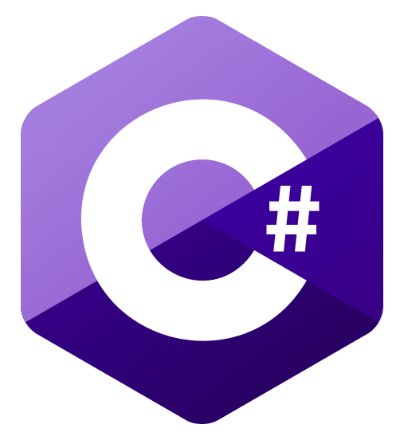
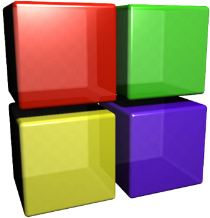
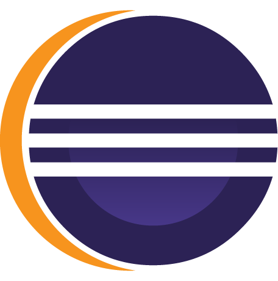
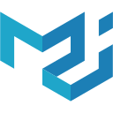

# Hey, I'm [Nano-AI](https://github.com/Nano-AI)! 

I'm a coder, gamer, and a piano player.

<a href="https://leetcode.com/SunCrusader/">LeetCode</a>

## Languages and Tools:
### Languages I Know/Use:
<kbd>

</kbd>

    
Languages in detail

- Python
- Java
- JavaScript & TypeScript (Basically the same thing)
- HTML, CSS
- C, C++, and C# (Partly know it)
- Go (Learning)
- Rust (Hope to learn soon)

### IDEs I Use

<kbd>

    

</kbd>

IDEs in detail
    
    
- [Vim](https://www.vim.org/) - Goto editor for every language. Using it with SpaceVim and Tmux.

- [Visual Studio Code](https://code.visualstudio.com/) - Used for bigger projects. Python, C, C++, Rust, JavaScript, TypeScript, HTML, CSS, Go.
 
- [Visual Studio](https://visualstudio.microsoft.com/) - C++ & C#
 
- [IntelliJ IDEA](https://www.jetbrains.com/idea/) - Java (Android Studio for Andriod dev)
    
- [CodeBlocks](http://www.codeblocks.org/) - C++ & C (Not using anymore)
    
- [PyCharm](https://www.jetbrains.com/pycharm/) - Python (Not using anymore)

- [Eclipse](https://www.eclipse.org/) - Java & C++ (Not using anymore)
    
- [Sublime Text](https://www.sublimetext.com/) - C (Not using anymore)

### Tools/Frameworks I Know/Use
<kbd>

</kbd>

Tools in detail

- [Node](https://nodejs.org/en/)
- [Bootstrap](https://getbootstrap.com/)
- [React](https://reactjs.org/)
- [Material UI](https://material-ui.com/)
- [Electron](https://www.electronjs.org/)

## GitHub Stats

