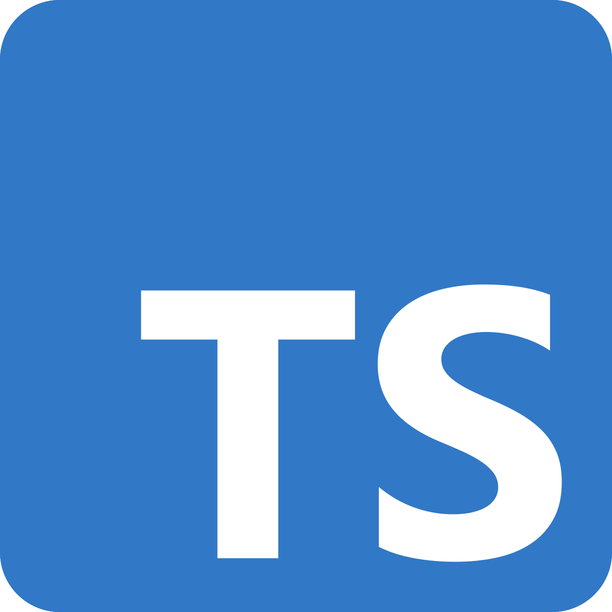
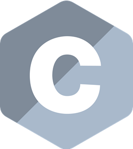
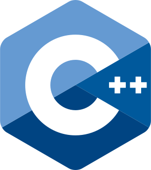
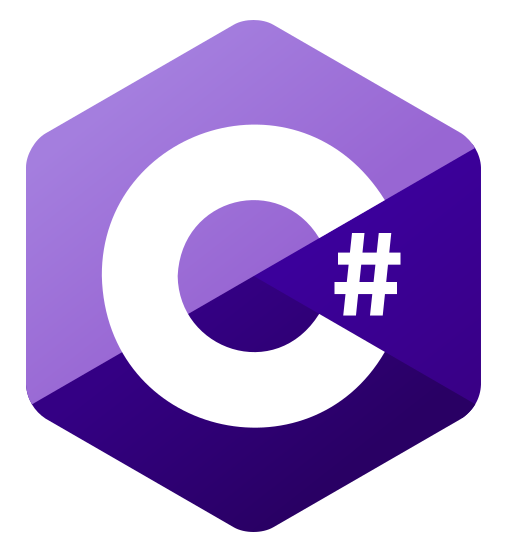
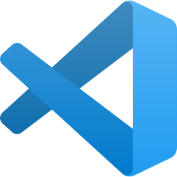
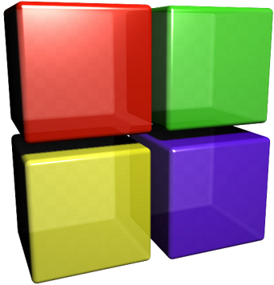
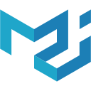

# Hey, I'm [Nano-AI]([https://github.com/Nano-AI](https://github.com/Nano-AI))! 

I'm a coder, gamer, and a piano player.
## Games:
- Counter Strike: Global Offensive
- Rainbow 6 Seige
- Minecraft
- Valorant
- Call of Duty: Warzone
- Apex Legends
- League of Legends

## Languages and Tools:
### Languages I Know/Use:
<kbd>

</kbd>

    
Languages in detail

- Python
- Java
- JavaScript & TypeScript (Basically the same thing)
- HTML, CSS
- C, C++, and C# (Partly know it)
- Go/Golang (Know little to none)
- Rust (Learning)

### IDEs I Use
<kbd>

</kbd>

IDEs in detail

- [PyCharm](https://www.jetbrains.com/pycharm/) - Python
- [IntelliJ IDEA](https://www.jetbrains.com/idea/) - Java
- [Visual Studio](https://visualstudio.microsoft.com/) - C++ & C#
- [Visual Studio Code](https://code.visualstudio.com/) - JavaScript
- [Eclipse](https://www.eclipse.org/) - Java & C++ (Not using anymore)
- [Sublime Text](https://www.sublimetext.com/) - C (Not using anymore)
- [CodeBlocks](http://www.codeblocks.org/) - C++ & C# (Not using anymore)
- [Vim](https://www.vim.org/) - C++ & C (Not using anymore)

### Tools/Frameworks I Know/Use
<kbd>

</kbd>

Tools in detail

- [Node](https://nodejs.org/en/)
- [Bootstrap](https://getbootstrap.com/)
- [React](https://reactjs.org/)
- [Material UI](https://material-ui.com/)
- [Electron](https://www.electronjs.org/) (Partly know)

## GitHub Stats

