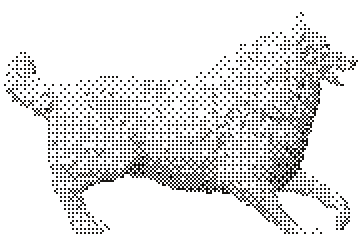
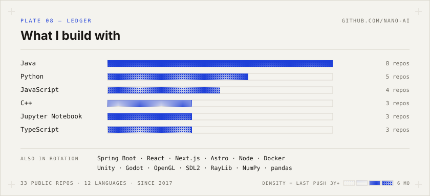

<picture>
  <source media="(prefers-color-scheme: dark)" srcset="./assets/husky-dark.gif">
  
</picture>

# Aditya Bankoti

**Computer Science @ the University of Washington** — Paul G. Allen School Software Engineer Intern at Costco Travel · Seattle, WA

    

## Now

- **Costco Travel** — building a full-stack DMN business-rules platform so analysts can author, test, and ship rules themselves. A custom web IDE plus atomic in-memory hot-reloading took rule deploys from three weeks to under a minute.
- **UW Seattle** — heading to the Allen School this fall after a year at UW–Madison (3.92 GPA; algorithms, matrix methods for ML, machine organization).
- **Writing** — long-form notes on things I take apart, over at [the blog](https://nano-ai.github.io/blog/).

Mostly interested in the seam where **graphics, systems, and ML** meet — renderers, retrieval, and anything I can make run offline.

## Selected work

| Project | What it is | |
| :--- | :--- | :--- |
| **Orion** `C++ · Metal` | A subscription-free raw photo editor for macOS. A C++20 engine drives a 27-node Metal compute graph, and because the edits form a DAG rather than a chain, moving a slider recomputes only what sits downstream — a 24 MP raw re-renders in about 8 ms at full resolution, no preview proxy. Every non-trivial filter cites a published reference; the ones that do not are listed in `research/UNSOURCED.md`. | [Site](https://nano-ai.github.io/Orion/) · [Code](https://github.com/Nano-AI/Orion) |
| **Nazar** `2nd · Dell×NVIDIA` | Air-gapped diagnostic AI on Dell GB10 hardware. An agentic loop over a local 122B LLM pairs BM25 retrieval with an evidence graph to trace cross-machine failures, citing every claim to an exact source line. | [Code](https://github.com/Dhruv-0-Arora/Nazar) |
| **Cypher** `3rd · CascadiaJS` | Real-time conflict-risk map. Event-driven Apify scrapes archived to Box for audit, Box AI extraction of structured flashpoints, XGBoost risk scoring, and Gemini narratives over an H3 hex heatmap. | [Code](https://github.com/Nano-AI/cascadia26) |
| **Fegis** `live` | Browser extension that flags sensitive data — API keys, client data, PDFs — *before* you paste it into an AI tool. Runs fully locally across the major LLM web apps. | [Try it](https://fegis.vercel.app/) |
| **Focus Tracker** `terminal` | A performance dashboard for the terminal that ships two interfaces over one SQLite database: an Ink TUI for people, and a headless JSON command surface for agents — `focus-tracker schema` prints the whole contract, every call returns one envelope. | [Site](https://nano-ai.github.io/Focus-Tracker/) · [Code](https://github.com/Nano-AI/Focus-Tracker) |
| **Staff Code** `nonprofit` | A free coding bootcamp I founded and ran from 2021–2025, teaching CS fundamentals to 50+ middle- and high-school students. | [Site](https://staffcode.dev) |
| **MedCheck** `3rd · Badger Build` | An Ethereum ledger letting pharmacies log drug batches on-chain, with QR codes patients scan to verify authenticity and dosage. Built in 36 hours, first time touching Solidity. | [Code](https://github.com/Nano-AI/Med-Check) · [Demo](https://www.youtube.com/watch?v=cdb0WkGtaUc) |

<b>Older things, mostly built to find out how something works</b>

 

**Graphics & engines** — [ray tracer in Java](https://www.youtube.com/watch?v=9r9MSqD6vKc) (depth, lighting, transparency) · [Wolfenstein-style ray caster](https://www.youtube.com/watch?v=U9RTGmFqN7U) · [fractal renderer](https://www.youtube.com/watch?v=baKRlHixcQY) · [PSX-style demo scene in Godot](https://www.youtube.com/watch?v=1s81vzSt3_g) · [3D sphere collider in RayLib + C++](https://www.youtube.com/watch?v=-c1E1xJwxCU) · [OpenGL, attempt *n*](https://github.com/Nano-AI/LearnOpenGL)

**AI & ML** — [digit recognizer with a hand-rolled net](https://www.youtube.com/watch?v=c63ioyWuPUM) (NumPy only, custom GUI) · [Smarty Pants](https://www.youtube.com/watch?v=PzeFaZ95Kig), RAG over scholarship listings · [LLM-dev](https://github.com/Nano-AI/LLM-dev), learning to build them from the bottom

**Games & sims** — [SAT-Shark](https://www.youtube.com/watch?v=VZJzt6scgBU), multiplayer SAT prep over WebSockets · [Pac-Man from scratch](https://www.youtube.com/watch?v=TIrYUZJPQ_k), no libraries · [chess in C++/SDL2](https://www.youtube.com/watch?v=EjIU1NLMAPk) · [falling-sand simulator](https://www.youtube.com/watch?v=jb5hq8EoAU8) in WinGDI · [Unity movement shooter](https://www.youtube.com/watch?v=i5At7d9uaQ0)

**Full-stack** — [CleanEats](https://github.com/Nano-AI/CleanEats), barcode → nutrition ([demo](https://www.youtube.com/watch?v=FSq0EKt5-Bs)) · [Litter.ly](https://github.com/Nano-AI/litter.ly), a social network for community clean-ups ([demo](https://www.youtube.com/watch?v=dlUDO7SRVz8))

## Lab log

| When | What | Result |
| :--- | :--- | :--- |
| `Jul 2026` | Dell × NVIDIA Hackathon — **Nazar** | 2nd of 40 teams |
| `Jun 2026` | CascadiaJS 2026 — **Cypher** | 3rd place |
| `May 2026` | IMC Prosperity 4, algorithmic trading | Round 4 · top-quartile PnL |
| `Dec 2025` | Badger Build Fest — **MedCheck** | 3rd, blockchain track |
| `Jul 2025` | Yoodli vibe-coding hackathon — **Bludify** | Top-5 finalist |
| `Mar 2024` | HackPNW — **SAT-Shark** | Best Functionality |

## The ledger

<picture>
  <source media="(prefers-color-scheme: dark)" srcset="./assets/stats-dark.svg">
  
</picture>

Drawn by [`scripts/build-stats.mjs`](./scripts/build-stats.mjs), redrawn weekly from the GitHub API — no third-party stats service to go down.

## Writing

**[Ways to Decompose a Face](https://nano-ai.github.io/blog/posts/2026-04-23-eigenfaces/)** — `15 min` Eigenfaces from scratch with SVD, then NNMF: how each one reconstructs, compresses, and generates faces.

More at [nano-ai.github.io/blog](https://nano-ai.github.io/blog/).

---
